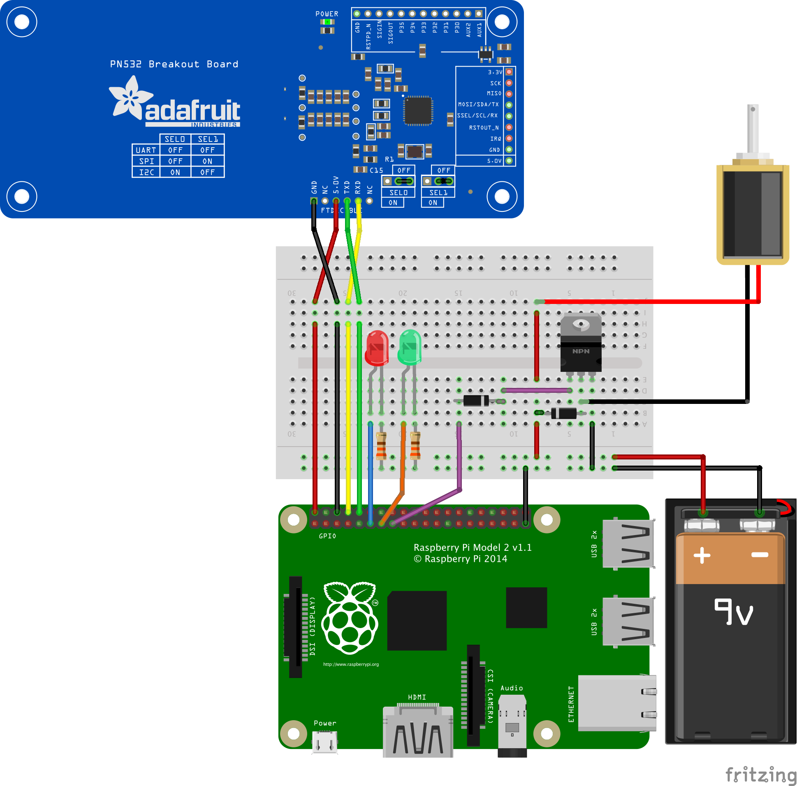

# Doorlock card reader for Raspberry PI

## Requirements

### Hardware

- [Raspberry PI 2 B](https://www.raspberrypi.org/products/raspberry-pi-2-model-b/)
- [Adafruit PN532](https://www.adafruit.com/products/364)
- A simple Breadboard to connect raspberry and PN532

### Software

- [Libcurl](https://curl.haxx.se/libcurl/)
- [Libnfc >= 1.7.1](https://github.com/nfc-tools/libnfc) 
- [Json-c >= 0.10-1.2](https://github.com/json-c/json-c)

## Setup

### Installing required packages

	sudo apt-get install git build-essentials libusb-dev libcurl4-openssl-dev libjson0-dev
	sudo apt-get install autoconf libtool libpcsclite-dev

### Freeing UART on the Raspberry PI running Raspbian GNU/Linux 7

	sudo raspi-config
	
- Go to option 8 	"Advanced Options"
- Go to option A8 "Serial" and select **NO**
- Finish and reboot: `sudo shutdown -r now`	

### Installing libnfc from source

####Preparing the environment
	
	cd ~ && mkdir -p tmp && cd tmp && mkdir -p /etc/nfc/devices.d
	git clone https://github.com/nfc-tools/libnfc.git
	cd libnfc
	sudo cp contrib/libnfc/pn532_uart_on_rpi.conf.sample /etc/nfc/devices.d/pn532_uart_on_rpi.conf
	sudo echo "allow_instrusive_scan =  true" >> /etc/nfc/devices.d/pn532_uart_on_rpi.conf
	
####Run config & build
	
	autoreconf -vis
	./configure --with-drivers=pn532_uart --sysconfdir=/etc --prefix=/usr
	sudo make clean && sudo make install all

### Wiring Raspberry PI 2 B & PNB532

- Raspberry pin 2 (5v) -- red wire -- > PNB532 FTDICABLE pin 5.0V
- Raspberry pin 6 (ground) -- black wire -- > PNB532 FTDICABLE pin GND
- Raspberry pin 8 (BCM 14 - TXD) -- yellow wire -- > PNB532 FTDICABLE pin TXD
- Raspberry pin 10 (BCM 15 - RXD) -- green wire -- > PNB532 FTDICABLE pin RXD

## References

- https://learn.adafruit.com/adafruit-nfc-rfid-on-raspberry-pi/
- https://curl.haxx.se/libcurl/c/libcurl-tutorial.html
- https://gist.github.com/leprechau/e6b8fef41a153218e1f4
- https://github.com/nfc-tools/libnfc/tree/master/examples
- https://netbeans.org/kb/docs/cnd/remotedev-tutorial.html
- http://pinout.xyz/

