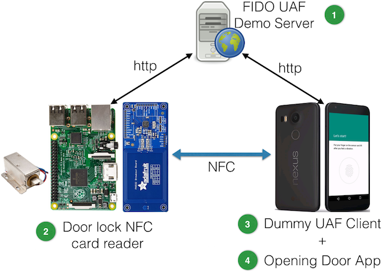
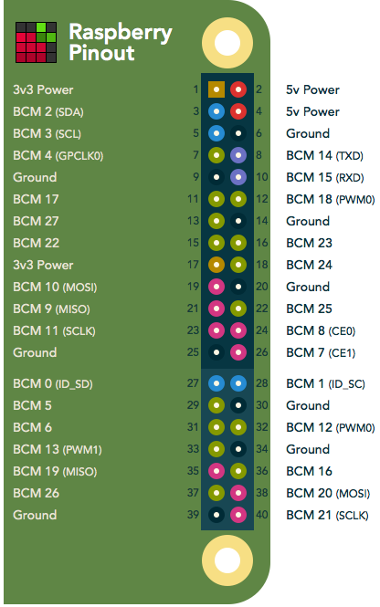

# Door lock NFC card reader for Raspberry PI

## Motivation

Is it possible to use [FIDO UAF Standard](https://fidoalliance.org/specifications/download/) on an Android mobile + NFC to opening doors?

This project is a simple prototype to verify how FIDO could be used in this scenario (see [FIDO Security Reference](https://fidoalliance.org/specs/fido-uaf-v1.0-ps-20141208/fido-security-ref-v1.0-ps-20141208.html#threats-to-the-secure-channel-between-client-and-relying-party)). This [card reader](https://github.com/emersonmello/doorlock_raspberrypi) uses NFC to communicate with a specific [Android Opening Door App](https://github.com/emersonmello/openingdoor), that emulates a NFC card using Android's [Host-based Card Emulation](https://developer.android.com/guide/topics/connectivity/nfc/hce.html) functionality.

The [card reader](https://github.com/emersonmello/doorlock_raspberrypi) and [Android Opening Door App](https://github.com/emersonmello/openingdoor) depend of a third-party, called [FIDO UAF RP Server](https://github.com/emersonmello/UAF).

Figure below shows all necessary components and the relation between them



1. [FIDO UAF Demo Server](https://github.com/emersonmello/UAF)
  - If you prefer, there is a [Docker container](https://www.docker.com/what-docker) ready to use here: https://github.com/emersonmello/docker-fidouafserver
2. [Door lock NFC card reader](https://github.com/emersonmello/doorlock_raspberrypi) <- You are working on it right now!
3. [Dummy FIDO UAF Client](https://github.com/emersonmello/dummyuafclient)
4. [Opening Door Android App](https://github.com/emersonmello/openingdoor)

## Hardware requirements

- 01 [Raspberry PI 2 B](https://www.raspberrypi.org/products/raspberry-pi-2-model-b/)
- 01 [Adafruit PN532](https://www.adafruit.com/products/364)
- 01 Breadboard to connect raspberry and PN532
- 01 N channel MOSFET - https://www.adafruit.com/products/355
- 01 Lock-style solenoid - https://www.adafruit.com/product/1512
- 02 Resistors - 300 Ohms
- 02 LED (red and green)
- 02 Diode 1N4001 - https://www.adafruit.com/product/755

### Wiring Raspberry PI 2 B & PNB532

1. To use UART on PNB532 breakout you must set to **OFF** the **SEL0** and **SEL1** jumpers
2. Follow instructions (and picture) below to connect all components


| Raspberry PI 2 B    | Wire color | PNB532 |
| ------------------- | :--------: | :----: |
| Pin 2 (5v)          |    RED     |  5.0V  |
| Pin 6 (ground)      |   BLACK    |  GND   |
| Pin 8 (BCM 14 TXD)  |   YELLOW   |  TXD   |
| Pin 10 (BCM 15 RXD) |   GREEN    |  RXD   |


| Raspberry PI 2 B | Wire color |        Component         |
| ---------------- | :--------: | :----------------------: |
| Pin 11 (BCM 17)  |    BLUE    |   Green LED anode (+)    |
| Pin 13 (BCM 27)  |    BLUE    |    RED LED anode (+)     |
| Pin 15 (BCM 22)  |   PURPLE   |    Diode #1 anode (+)    |
| Pin 39 (Ground)  |   BLACK    | Breadboard negative rail |


## Software requirements

- [Libcurl](https://curl.haxx.se/libcurl/)
- [Libnfc >= 1.7.1](https://github.com/nfc-tools/libnfc)
- [Json-c >= 0.11-4](https://github.com/json-c/json-c)
- [wiringPi library](http://wiringpi.com/)


### Installing required packages

	sudo apt-get install git build-essential autoconf libtool libpcsclite-dev
	sudo apt-get install libusb-dev libcurl4-openssl-dev libjson-c-dev

### Freeing UART on the Raspberry PI running Raspbian GNU/Linux 8

	sudo raspi-config

- Go to option 9 	"Advanced Options"
- (Ps: for Raspbian GNU/Linux 7 go to option 8)
- Go to option A8 "Serial" and select **NO**
- Finish and reboot: `sudo shutdown -r now`

### Installing libnfc from source

#### Preparing the environment

	cd ~ && sudo mkdir -p /etc/nfc/devices.d
	git clone https://github.com/nfc-tools/libnfc.git
	cd libnfc
	
	sudo cp contrib/libnfc/pn532_uart_on_rpi.conf.sample /etc/nfc/devices.d/pn532_uart_on_rpi.conf
	
	echo "allow_instrusive_scan =  true" | sudo tee -a  /etc/nfc/devices.d/pn532_uart_on_rpi.conf

#### Run config & build

	autoreconf -vis
	./configure --with-drivers=pn532_uart --sysconfdir=/etc --prefix=/usr
	sudo make clean && sudo make install all

#### Testing

You can test your setup reading an ISO14443-A card using `nfc-poll` program that came with `libnfc`. Place a card on the reader and run the command:


	cd ~/libnfc/examples
	./nfc-poll

### Installing wiringPi from source

- Please, follow the instructions provided by [official website](http://wiringpi.com/download-and-install).


## Running door lock NFC card reader on Raspberry PI

1. Get the source code
- `cd ~ && git clone https://github.com/emersonmello/doorlock_raspberrypi.git`
- `cd doorlock_raspberrypi`
2. Change **HOSTNAME** and **PORT** values on [Door lock NFC card reader's rp_settings.h file](https://github.com/emersonmello/doorlock_raspberrypi/blob/master/rp_settings.h) to the **IP Address** and **PORT** where you are running the **FIDO UAF Demo Server**
  - For instance: `nano rp_settings.h`
3. Compile **Door lock NFC card reader** project
  - `make clean && make`
4. Run it (sorry, you must be root because it is a requirement of wiringPi lib)
    - For instance: `sudo ./dist/Debug/GNU-Linux/doorlock_raspberrypi`

### Setting up FIDO UAF Demo Server and Android Apps

#### FIDO UAF Demo Server

1. Start **FIDO UAF Demo Server**
- Follow the instructions provided by:
  - [FIDO UAF Demo Server](https://github.com/emersonmello/UAF)
  - Or, if you prefer, there is a [Docker container](https://www.docker.com/what-docker) ready to use [here](https://github.com/emersonmello/docker-fidouafserver)

#### On Android Phone

1. Install [Dummy FIDO UAF Client](https://github.com/emersonmello/dummyuafclient) on your Android phone
2. Install [Opening Door Android App](https://github.com/emersonmello/openingdoor) on your Android phone
3. On **Opening Door Android App** touch on "Settings" on the main application menu and update "server endpoint" field to the **IP Address** and **PORT** where you are running the **FIDO UAF Demo Server**  
4. On **Opening Door Android App** touch on "Whitelisting facetID" (to follow [FIDO UAF specifications](https://fidoalliance.org/specs/fido-uaf-v1.1-id-20170202/fido-appid-and-facets-v1.1-id-20170202.html) ).
   1. Or you can do it: On **Opening Door Android App** touch on "See app facetID" on the main application menu and insert the showed value in [FIDO UAF Demo Server](https://github.com/emersonmello/UAF) MySQL database. For instance: ```INSERT INTO facets (fDesc) values ('android:apk-key-hash:Lir5oIjf552K/XN4bTul0VS3GfM')```

### Testing the whole thing

1. Open **Opening Door Android App** and touch "Register" button
2. Tap your mobile phone on "NFC reader"
3. Follow the instructions provided by application (i.e. put your finger on the sensor, etc.) and you should see the message "Access Granted"

## UML Sequence Diagram


## Starting door lock automatically on Raspberry boot

I'm using [supervisord](http://supervisord.org/) to handle this task because it can also restart a failed process

1. Copy `doorlock_raspberrypi` binary to /usr/local/bin
  - `sudo cp ~/doorlock_raspberrypi/dist/Debug/GNU-Linux/doorlock_raspberrypi /usr/local/bin`
2. Installing python2.7
    - `sudo apt-get install python`
3. Installing supervisord
    - `sudo easy_install supervisor`
    - `echo_supervisord_conf | sudo tee /etc/supervisord.conf`
4. Adding a program section to supervisord's configuration file
    - Add the follow lines at the end of **/etc/supervisord.conf** file
    ```
    [program:doorlock]
    command=/usr/local/bin/doorlock_raspberrypi
    ```
    - For instance:
    ```
    printf "[program:doorlock]\n command=/usr/local/bin/doorlock_raspberrypi \n" | sudo tee -a  /etc/supervisord.conf
    ```
5. Download [supervisord.sh](supervisord.sh) file and save it at `/etc/init.d`

 ```
 sudo cp ~/doorlock_raspberrypi/supervisord.sh /etc/init.d
 sudo chmod 755 /etc/init.d/supervisord.sh
 sudo update-rc.d supervisord.sh defaults
 ```

## References

- https://learn.adafruit.com/adafruit-nfc-rfid-on-raspberry-pi/
- https://curl.haxx.se/libcurl/c/libcurl-tutorial.html
- https://gist.github.com/leprechau/e6b8fef41a153218e1f4
- https://github.com/nfc-tools/libnfc/tree/master/examples
- https://netbeans.org/kb/docs/cnd/remotedev-tutorial.html
- http://pinout.xyz/


